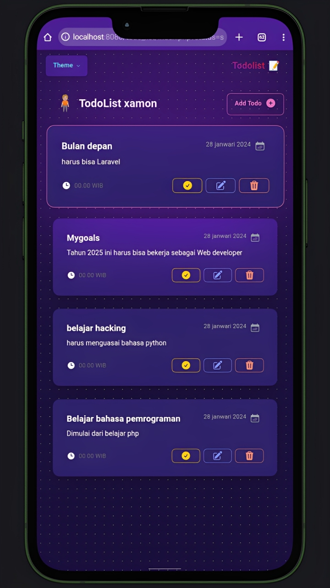

# Todo App ✨

Todo App adalah aplikasi pengelola tugas yang **sederhana namun powerful**. Dengan antarmuka pengguna yang **bersih** dan **intuitif**, aplikasi ini memungkinkan pengguna untuk membuat, mengedit, dan menghapus tugas sehari-hari dengan mudah. Aplikasi ini menggunakan teknologi terbaru untuk memastikan pengalaman pengguna yang lancar dan responsif.

### Screenshot 📸


## Fitur 🎯
- ✅ Tambah, edit, dan hapus tugas.
- 🎉 Tandai tugas sebagai selesai.
- 📱 Tampilan responsif dan mudah digunakan.
- 💾 Simpan data tugas secara lokal.
- ✨ Tersedia banyak pilihan Tema.

## Teknologi yang Digunakan 🛠️

### Frontend
Saya menggunakan teknologi berikut untuk membangun antarmuka pengguna:
- **HTML**
- **CSS**
- **JavaScript**
- **TailwindCSS**
- **DaisyUI** (Plugin untuk mempercantik elemen UI)

### Backend
- **PHP Native** (Untuk pengelolaan server dan penyimpanan data)

### Database
- **MySQL** (Untuk penyimpanan data secara relasional)

## Cara Instalasi 📥

### Persyaratan 💻
Pastikan Anda memiliki **PHP** dan **MySQL** yang sudah terinstall di komputer Anda. Anda juga perlu **Node.js** dan **npm** untuk mengelola dependensi frontend. Jika belum, silakan kunjungi:
- [PHP](https://www.php.net/)
- [MySQL](https://www.mysql.com/)
- [Node.js](https://nodejs.org/) untuk mengunduh dan menginstalnya.

### Langkah-langkah Instalasi 🏗️

1. **Clone repository ini**
   ```bash
   git clone https://github.com/xamonxx/todo_app.git

2. **Masuk ke folder proyek**
    ```bash
    cd todo_app
    
3. **Install dependencies frontend menggunakan npm**
    ```bash
    npm install

4. **Jalankan aplikasi frontend**
    ```bash
    npm start

Aplikasi akan berjalan di http://localhost:3000.


5. Konfigurasi backend PHP dan MySQL:

Sesuaikan konfigurasi database di file db_conn.php dengan informasi login MySQL Anda.

Jalankan aplikasi PHP di server lokal atau hosting yang mendukung PHP dan MySQL.

### Cara Penggunaan 📝

1. Setelah aplikasi berjalan, Anda akan melihat tampilan daftar tugas.


2. Klik tombol Tambah Tugas untuk membuat tugas baru dengan mengklik Add todo.


3. Tandai tugas yang sudah selesai dengan mengklik checkbox di samping tugas. ✔️


4. Untuk menghapus tugas, klik ikon hapus di sebelah tugas yang ingin dihapus. ❌


5. Untuk ganti tema anda bisa, klik di pojok atas kiri dan sesuaikan dengan tema yang pas untuk anda.


### Kontribusi 🤝

Jika Anda ingin berkontribusi pada proyek ini, silakan fork repository ini dan buat pull request. Pastikan untuk mengikuti pedoman pengkodean dan memberikan deskripsi yang jelas pada setiap perubahan yang Anda buat.

### XAMON 👾


